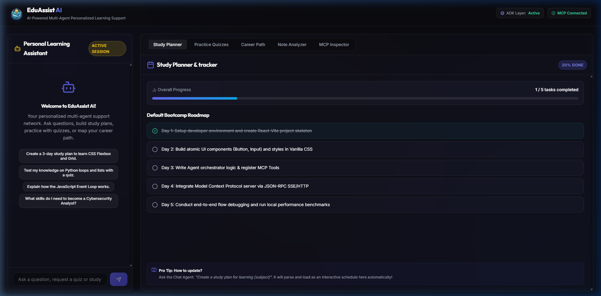
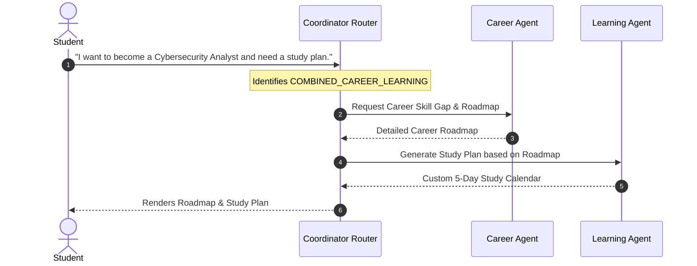
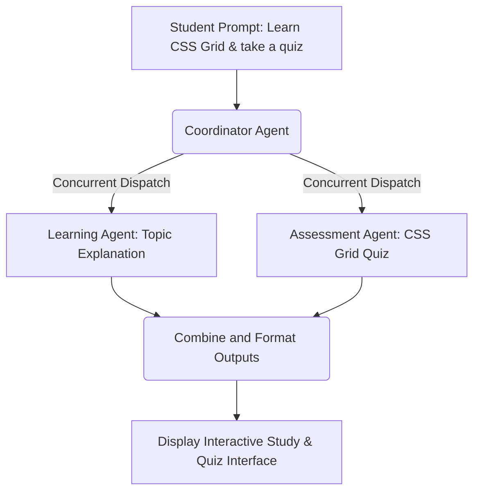

# EduAssist AI 🎓

EduAssist AI is an advanced, premium, multi‑agent educational assistance platform built with React, TypeScript, and Vite. It orchestrates multiple specialized AI agents to deliver personalized study plans, dynamic knowledge testing, and career path mappings.

---

## 📸 Interface Preview



---

## 🏛️ System Architecture

EduAssist AI utilizes a hierarchical multi‑agent coordination layout. A central **Coordinator Agent** acts as an orchestrator that analyzes user inputs, determines the intent, and dynamically executes specialized agents using sequential, parallel, or direct routing workflows.

```
                  ┌──────────────────────┐
                  │     User Prompt      │
                  └──────────┬───────────┘
                             │
                             ▼
               ┌───────────────────────────┐
               │    Coordinator Agent      │
               │    (Intent Routing)       │
               └─────────────┬─────────────┘
                             │
       ┌─────────────────────┼─────────────────────┐
       ▼                     ▼                     ▼
┌──────────────┐      ┌──────────────┐      ┌──────────────┐
│  Learning    │      │  Assessment  │      │    Career    │
│   Agent      │      │    Agent     │      │    Agent     │
└──────────────┘      └──────────────┘      └──────────────┘
```

### Specialized Agents
1. **Coordinator Router**: Uses the LLM to inspect user prompts and route queries. It dynamically schedules workflows (direct, sequential, or parallel).
2. **Learning Agent**: Builds custom, step-by-step study plans, schedules, and learning resource lists tailored to the student's constraints.
3. **Assessment Agent**: Creates interactive practice quizzes, scores responses, and provides comprehensive feedback on knowledge gaps.
4. **Career Agent**: Maps job role requirements, conducts skill gap analyses, and builds professional development roadmaps.

---

## 🔄 Dynamic Workflows & Flow Diagrams

### 1. Sequential Workflow (`COMBINED_CAREER_LEARNING`)
Used when a student requests career guidance combined with a learning timeline.
* **Step 1:** The Career Agent compiles a specialized roadmap for the desired career path.
* **Step 2:** The Coordinator feeds that roadmap directly into the Learning Agent to formulate a day-by-day learning plan.



### 2. Parallel Workflow (`COMBINED_LEARNING_ASSESSMENT`)
Used when a student asks to learn a subject and immediately take a quiz.
* The Learning Agent generates explanations/resources while the Assessment Agent compiles a practice quiz concurrently.



### Architecture Flow Diagram
For a detailed diagram of the agent communications and coordinator logic, see the [Architecture Flow Diagram](docs/architecture_flow.png).

---

## 🛠️ Setup & Running Guidelines

Follow these steps to run EduAssist AI locally on your system:

### Prerequisites
* **Node.js** (v18 or higher recommended)
* **npm** (v9 or higher)
* A **Gemini API Key** from Google AI Studio.

### Installation

1. **Clone the Repository:**
   ```bash
   git clone https://github.com/kailasp4/EduAssist-AI.git
   cd EduAssist-AI
   ```

2. **Install Dependencies:**
   ```bash
   npm install
   ```

3. **Configure Environment Variables:**
   Create a `.env` file in the root directory of the project and add your Gemini API Key:
   ```env
   GEMINI_API_KEY=your_gemini_api_key_here
   ```
   *Note: If no API key is provided, the application will fallback to an intelligent mock model so you can still preview the UI and agent flows.*

### Running the Application

Start both the backend orchestrator and front-end development server concurrently:
```bash
npm run dev
```

* **Vite Web Dashboard:** Serves by default at `http://localhost:5173/` (or `http://localhost:5174/`).
* **Coordinator API Server:** Starts on port `3001`.

---

## 📐 Project Structure

```
EduAssist-AI/
├── public/
│   └── logo.png              # Cropped transparent logo
├── docs/                     # Project screenshots & flow diagrams
│   ├── app_screenshot.png
│   ├── architecture_flow.png
│   └── chat_ui_mock.png
├── src/
│   ├── components/           # React UI components (Chat, StudyPlanner, Quiz)
│   ├── assets/               # Styled theme logo and icons
│   ├── lib/
│   │   ├── adk/              # Agent Development Kit (Agent base, Workflows)
│   │   ├── agents/           # Specialized Agents (Coordinator, Career, Learning, Assessment)
│   │   └── mcp/              # Model Context Protocol integrations
│   ├── App.tsx               # Main application container
│   ├── main.tsx              # React entry point
│   └── index.css             # Main styling stylesheet (Glassmorphism layout)
└── package.json
```

---

## 📜 License
This project is licensed under the MIT License.
